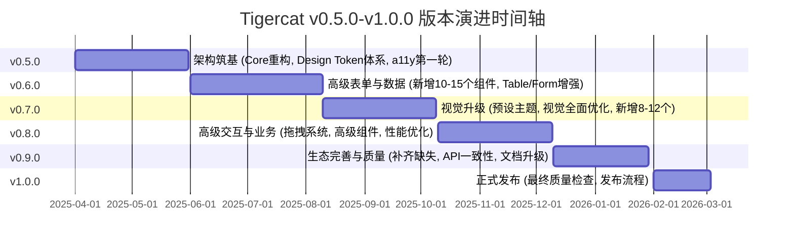
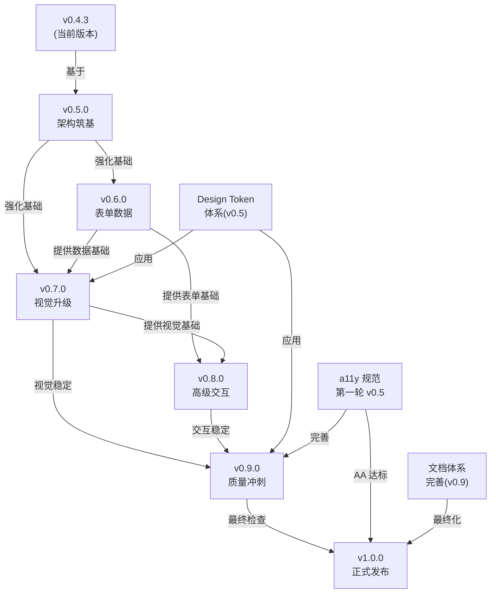
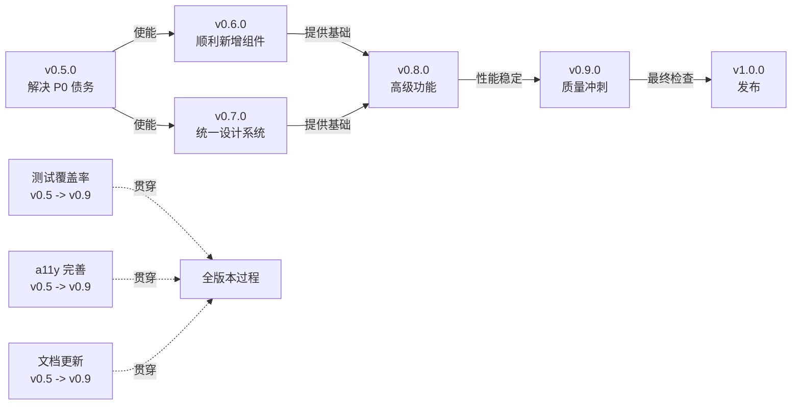

# Tigercat v0.5.0-v1.0.0 版本路线图与开发规划

---

## 文档概览

本文档为 Tigercat UI 组件库从 **v0.4.3 → v1.0.0** 的完整版本演进规划。每个版本都代表一次**实质性的、多维度的升级**，包括：

- **架构改动** — 底层基础设施的优化与重构
- **新增组件** — 批量补齐与主流库的差距
- **现有组件增强** — 功能、交互、样式的持续迭代
- **工程建设** — 测试、文档、性能、构建等基础设施完善
- **设计系统** — 主题、Token、预设的成熟化

---

## 1. 版本演进路线图

### 时间轴与里程碑

### 版本定位与目标

| 版本       | 定位           | 核心目标                                             | 版本号增长理由                                  |
| ---------- | -------------- | ---------------------------------------------------- | ----------------------------------------------- |
| **v0.5.0** | 架构筑基       | 强化 Core 包，完善设计系统基础，为后续快速迭代做准备 | 架构级升级，为整个 v0.x 时期奠定基调            |
| **v0.6.0** | 表单数据专项   | 大幅扩展表单能力和数据展示，补齐 B 端核心需求        | 新增 10-15 个高优先级组件，Table/Form 重大升级  |
| **v0.7.0** | 视觉升级       | 提升整体视觉品质，推出预设主题，为 v1.0 做审美准备   | 设计系统完善，新增 8-12 个视觉/反馈类组件       |
| **v0.8.0** | 高级交互与业务 | 面向复杂业务场景，提供拖拽、编辑、高级组件           | 交互系统抽象，新增 8-12 个高级/业务组件         |
| **v0.9.0** | 生态完善与质量 | 补齐剩余组件，API 统一，无障碍全覆盖，文档站升级     | 冲刺 v1.0 稳定性，实现 100+ 组件目标            |
| **v1.0.0** | 正式发布       | 承诺 API 稳定性，发布生产级企业级库                  | 里程碑版本，breaking changes 冻结，长期维护承诺 |

---

## 2. 版本间依赖关系图

### 逻辑依赖

### 依赖详解

1. **v0.5.0 是基础** — Core 包重构、Design Token 体系、类型系统强化是所有后续版本的基石
2. **v0.6.0 与 v0.7.0 平行** — 表单/数据能力和视觉升级互相增强，但不阻塞（v0.6.0 完成后 v0.7.0 可充分利用新组件进行样式设计）
3. **v0.8.0 依赖前序完成** — 需要 v0.6.0 的数据能力和 v0.7.0 的视觉一致性
4. **v0.9.0 是最后冲刺** — 汇总所有前序版本的问题，进行最后的 API 一致性、无障碍、文档等质量检查
5. **v1.0.0 是发布** — 不再新增功能，仅进行最终验收和发布流程

---

## 3. 版本内容量化摘要

### 组件补齐进度

| 版本   | 新增组件数 | 增强组件数 | 累计总数 | 覆盖率对标                  |
| ------ | ---------- | ---------- | -------- | --------------------------- |
| v0.4.3 | 60         | -          | 60       | 对标 Ant Design 的 74%      |
| v0.5.0 | 0          | 15-20      | 60       | 架构为主，无新增            |
| v0.6.0 | 12-15      | 15-20      | 72-75    | 突破 90%，接近 Element Plus |
| v0.7.0 | 8-12       | 15-20      | 85-95    | 超过 100% 相比 Ant Design   |
| v0.8.0 | 8-12       | 15-20      | 95-105   | 达成 100+ 组件目标          |
| v0.9.0 | 5-8        | 20-25      | 105-115  | 完整覆盖主流需求            |
| v1.0.0 | 0          | 5-10       | 105-115  | 稳定不增加                  |

### 工程建设进度

| 版本   | Core 包  | 测试覆盖率 | 文档站 | 国际化 | 无障碍    | 主题/Token |
| ------ | -------- | ---------- | ------ | ------ | --------- | ---------- |
| v0.4.3 | 基础     | ~60%       | MVP    | 部分   | 部分      | 基础       |
| v0.5.0 | 重构完成 | 80%+       | 同步   | 同步   | 第一轮    | 完整系统   |
| v0.6.0 | 稳定     | 85%+       | 扩展   | 扩展   | 第二轮    | 应用       |
| v0.7.0 | 稳定     | 88%+       | 完善   | 10语言 | 第三轮    | 5+ 预设    |
| v0.8.0 | 稳定     | 90%+       | 完善   | 同步   | 第四轮    | 稳定       |
| v0.9.0 | 稳定     | 92%+       | 优化   | 同步   | AA 全覆盖 | 稳定       |
| v1.0.0 | 冻结     | 95%+       | 发布   | 冻结   | 发布      | 发布       |

### 预估工时

| 版本     | 估算人月  | 主要类别               | 风险等级                      |
| -------- | --------- | ---------------------- | ----------------------------- |
| v0.5.0   | 10-12     | 架构重构、设计系统     | 🔴 高 (涉及 breaking changes) |
| v0.6.0   | 12-15     | 新增组件、现有组件增强 | 🟡 中                         |
| v0.7.0   | 10-12     | 视觉优化、主题系统     | 🟡 中                         |
| v0.8.0   | 12-14     | 高级交互、拖拽系统     | 🟡 中                         |
| v0.9.0   | 8-10      | 补齐缺失、质量冲刺     | 🟢 低                         |
| v1.0.0   | 4-6       | 发布流程、最终验收     | 🟢 低                         |
| **总计** | **56-69** | -                      | -                             |

---

## 4. 技术债务追踪表

### 现有代码中推断的技术债务及计划解决版本

| #   | 技术债务                                     | 当前状态                  | 影响范围                   | 计划版本      | 优先级 | 备注                             |
| --- | -------------------------------------------- | ------------------------- | -------------------------- | ------------- | ------ | -------------------------------- |
| 1   | Props 命名不一致 (visible vs open vs isOpen) | 混用                      | 所有组件                   | v0.5.0        | P0     | 需要大规模重构，breaking changes |
| 2   | Core 包逻辑重复（Chart utils 等）            | 2400+ 行单文件            | 图表、数据                 | v0.5.0        | P0     | 需要模块化拆分                   |
| 3   | 类型定义不够严格（泛型支持缺失）             | 基础 Props 类型           | Form、Table、Select        | v0.5.0        | P1     | `Table<T>`, `Select<T>` 等       |
| 4   | Design Token 体系不完善                      | 仅有 --tiger-\* CSS 变量  | 全库                       | v0.5.0        | P0     | 需要完整三层 Token 体系          |
| 5   | 测试覆盖率不足                               | ~60%                      | 全库                       | v0.5.0-v0.9.0 | P0     | 分阶段提升到 95%+                |
| 6   | 国际化组件不完整                             | 部分组件                  | i18n                       | v0.6.0        | P1     | 新增组件需配套 i18n              |
| 7   | 无障碍 (a11y) 覆盖不全                       | 部分组件                  | 全库                       | v0.5.0-v0.9.0 | P0     | 分轮次提升到 WCAG 2.1 AA         |
| 8   | 文档自动生成缺失                             | 手工维护                  | 文档                       | v0.9.0        | P1     | 需要 API 文档自动生成工具        |
| 9   | 浮动弹出层逻辑重复                           | useFloatingPopup/usePopup | Tooltip/Popover/Popconfirm | v0.5.0        | P2     | 可进一步抽象                     |
| 10  | Bundle Size 优化空间                         | 待评估                    | 构建产物                   | v0.8.0        | P2     | 虚拟化组件需要性能评估           |
| 11  | 暗色模式适配不完整                           | 基础支持                  | 全库                       | v0.7.0        | P1     | 需要所有组件视觉审查             |
| 12  | 破坏性变更追踪缺失                           | 无系统追踪                | CHANGELOG                  | v0.5.0        | P1     | 需要建立 breaking changes 文档   |

### 技术债务对版本的影响评估

---

## 5. 版本间 Breaking Changes 预警

### v0.5.0 预计 Breaking Changes

**重要**: v0.5.0 将进行大规模架构重构，预期多个 breaking changes:

1. **Props 命名统一** (影响所有组件)
   - `visible` → `open` (标准化)
   - `isOpen` → `open` (对齐 Chakra/React Hook Form 等)
   - 影响: Modal, Drawer, Dropdown, Menu, Popover, Tooltip 等
   - 迁移成本: 🔴 高

2. **类型导出调整**
   - 将分散的 types 统一到 `@expcat/tigercat-core/types`
   - 影响: 所有 TypeScript 用户
   - 迁移成本: 🟡 中

3. **CSS 变量命名**
   - `--tiger-*` → `--tc-*` (更短、更专业)
   - 或保持 `--tiger-*`，但增加语义层级 `--tiger-color-*`
   - 影响: 自定义主题的用户
   - 迁移成本: 🟡 中

4. **Core 包模块结构**
   - 将 `chart-utils.ts` 拆分为独立模块
   - 可能影响 subpath imports
   - 影响: 高级用户的 tree-shaking 配置
   - 迁移成本: 🟢 低

### 迁移指南发布计划

- v0.5.0 发布时，同时发布详细的 [MIGRATION_v0.5.0.md](./MIGRATION_v0.5.0.md)
- 包含所有 breaking changes 列表和逐项迁移说明
- 提供自动化脚本或 codemod 工具协助迁移

---

## 6. 详细版本文档导航

每个版本都有对应的详细规格文档，包含完整的实现指引、API 规范、代码示例、验收标准：

| 文档                                     | 内容               | 关键信息                                       |
| ---------------------------------------- | ------------------ | ---------------------------------------------- |
| [01-v0.5.0-SPEC.md](./01-v0.5.0-SPEC.md) | 架构筑基与核心增强 | Core 重构、Design Token 体系、a11y 第一轮      |
| [02-v0.6.0-SPEC.md](./02-v0.6.0-SPEC.md) | 高级表单与数据组件 | 新增 12-15 个组件，Table/Form 重大升级         |
| [03-v0.7.0-SPEC.md](./03-v0.7.0-SPEC.md) | 视觉升级与样式系统 | 预设主题、视觉全面优化、暗色模式优化           |
| [04-v0.8.0-SPEC.md](./04-v0.8.0-SPEC.md) | 高级交互与业务组件 | 拖拽系统、高级组件、性能优化                   |
| [05-v0.9.0-SPEC.md](./05-v0.9.0-SPEC.md) | 生态完善与质量冲刺 | 补齐缺失、API 一致性、文档升级、无障碍 AA 达标 |
| [06-v1.0.0-SPEC.md](./06-v1.0.0-SPEC.md) | 正式发布           | 稳定性保证、发布流程、后续维护计划             |

---

## 7. 附录文档导航

详见 `appendix/` 目录：

| 文档                                                                  | 内容                  | 用途                             |
| --------------------------------------------------------------------- | --------------------- | -------------------------------- |
| [A-COMPONENT-GAP-ANALYSIS.md](./appendix/A-COMPONENT-GAP-ANALYSIS.md) | 竞品组件对标分析      | 确定缺失组件优先级和分配版本     |
| [B-DESIGN-TOKEN-SPEC.md](./appendix/B-DESIGN-TOKEN-SPEC.md)           | Design Token 完整规格 | Design Token 体系的详细定义      |
| [C-A11Y-CHECKLIST.md](./appendix/C-A11Y-CHECKLIST.md)                 | 无障碍合规检查清单    | WCAG 2.1 AA 合规检查和实现指引   |
| [D-COMPONENT-TEMPLATE.md](./appendix/D-COMPONENT-TEMPLATE.md)         | 新组件实现模板        | Copilot 可直接使用的组件实现模板 |

---

## 8. 快速查询：我需要了解什么？

### 如果你是…

- **🎯 项目管理者** → 先读本文档的「版本定位」和「预估工时」，然后深入[版本规格文档](#6-详细版本文档导航)
- **💻 前端开发者（新增组件）** → 查看[D-COMPONENT-TEMPLATE.md](./appendix/D-COMPONENT-TEMPLATE.md)，然后按相应版本的组件规格实现
- **🎨 设计师/视觉工程师** → 重点关注 v0.5.0 的[Design Token](./appendix/B-DESIGN-TOKEN-SPEC.md)和 v0.7.0 的主题系统
- **♿ 无障碍工程师** → 查看[C-A11Y-CHECKLIST.md](./appendix/C-A11Y-CHECKLIST.md)，追踪各版本的 a11y 完善进度
- **📊 数据结构设计者** → 关注 v0.6.0 的 Table/Form/Tree 升级和 v0.8.0 的虚拟化
- **🤖 Copilot/AI 编码助手** → 每个版本规格文档都是完整的、可直接执行的开发指令，逐行逐项执行即可
- **🔧 QA/测试工程师** → 每个版本文档都包含「验收标准」章节，按此执行测试

---

## 9. 关键决策与待定项

### 已决策

✅ **框架支持**: 继续 Vue 3 + React 双端实现
✅ **技术栈**: Tailwind CSS 3.4+ / TypeScript 5.x / pnpm monorepo
✅ **CSS 变量命名**: 保持 `--tiger-*`，但扩展为语义层级 `--tiger-color-primary-*`
✅ **Props 命名**: 统一为 `open` (vs `visible`)，`disabled`，`size`，`variant`
✅ **预设主题数**: 目标 5+ 套（v0.7.0）
✅ **国际化语言**: 至少支持中、英文，可扩展到 8+ 种语言（v0.9.0）

### 待定项（需社区反馈）

❓ **Radix Primitives 集成**: 是否采用 Radix 作为无样式基础层？ (初步判断: 暂时不集成，自行实现 headless 抽象)
❓ **图表库扩展**: 是否集成 Echarts/Recharts，还是继续纯 SVG？ (初步判断: 继续纯 SVG，保持轻量)
❓ **移动端优先**: 是否做 React Native 支持？ (初步判断: v1.0+ 再评估)
❓ **颜色盲模式**: 除了高对比度，是否需要特殊的颜色盲友好配色？ (初步判断: v0.9.0 考虑)

---

## 10. 联系与反馈

- **GitHub Issues**: https://github.com/expcat/Tigercat/issues
- **讨论区**: https://github.com/expcat/Tigercat/discussions
- **社区文档**: 每个版本发布时同步发布详细的发布说明 (Release Notes)

---

**最后更新**: 2025-03-09
**适用版本**: v0.4.3 及以后
**文档级别**: 官方规划文档，面向开发者、贡献者、用户
